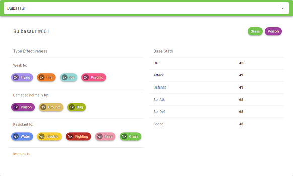
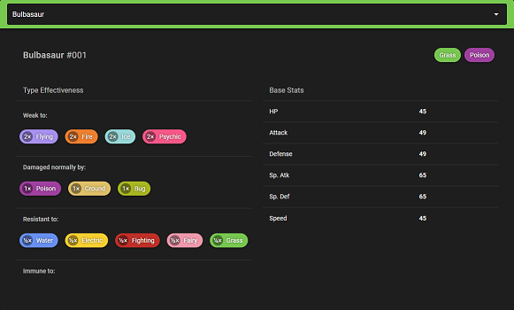

# pokemon-type-check

An app for quickly looking up information about a Pokémon, written in [Vue.js](https://vuejs.org/) using [Vuetify](https://vuetifyjs.com/en/).

## Features
- Search for Pokémon by name with autocomplete
- Includes all Pokémon through Gen VIII (Sword & Shield) with alternate forms
- Quickly see type, type effectiveness, and base stats
- Material UI with automatic light/dark theme switching (based on your system theme)




## Issues
- Alternate forms are listed by Japanese name.
- A bit broken on mobile right now - base stats disappear when dismissing the keyboard in Chrome, and the info panel doesn't show at all in Firefox.


## Project setup
```
npm install
```

### Compiles and hot-reloads for development
```
npm run serve
```

### Compiles and minifies for production
```
npm run build
```

### Customize configuration
See [Configuration Reference](https://cli.vuejs.org/config/).


## Credits
- Original dataset from https://www.kaggle.com/sacchin/pokemon-with-stats-generation-8
- Type colors and effectiveness from [Bulbapedia](https://bulbapedia.bulbagarden.net/wiki/Main_Page)